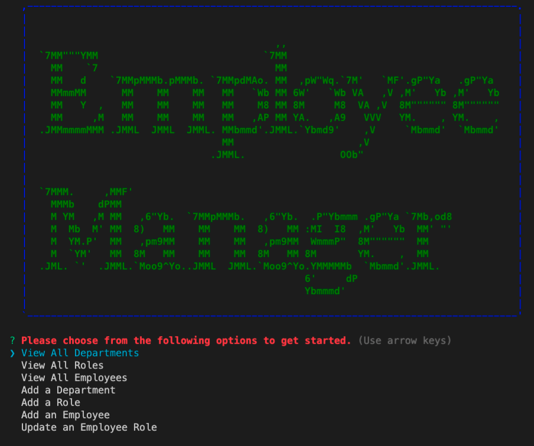

# Employee_Tracker-x
An App for keeping track of employees 

## Description

This is a command line program that allows the user to manage personnel of a company. 




The code and all relevant files can be found at [https://github.com/jeodom17/Employee_Tracker-x](https://github.com/jeodom17/Employee_Tracker-x). 


## Table of Contents

- [Installation](#installation)

- [Features](#features)

- [Usage](#usage)

- [Credits](#credits)


## Installation

1) Navigate to [https://github.com/jeodom17/Employee_Tracker-x](https://github.com/jeodom17/Employee_Tracker-x)

2) Clone the repository to your local machine

3) Open your preferred CLI (Terminal, GitBash, etc.) and cd to the directory where you cloned the repo

4) Use the following command to install the required dependencies (dependency information can be found in [package.json](./package.json))
```
npm ci
```  

## Features  
This program stores and accesses company personnel information in a MySQL database and allows the user to:

- Employees
  - View all employees
  - Add employees
  - Update employee role and/or manager

- Roles
  - View all roles
  - Add roles

- Departments
  - View all departments
  - Add departments


## Usage

To use this Team Profile Generator:

1) Copy the SQL code in DBschema.sql into your MySQL GUI and run to create the database and necessary tables

    
2) Open your preferred CLI and cd to the Employee-Tracker directory

3) Run the following command to begin the application
```
node index.js
```
4) Use the up/down arrows on keyboard to navigate through options on the main menu

5) Follow the instructions presented for each action to view/create/update information


## Credits

Solo project for GATech Coding Bootcamp
by Justin Odom
- [Github Page](https://github.com/jeodom17)


